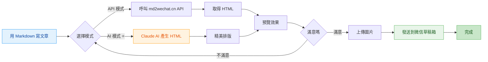
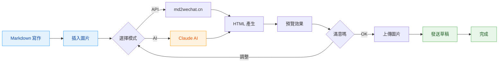
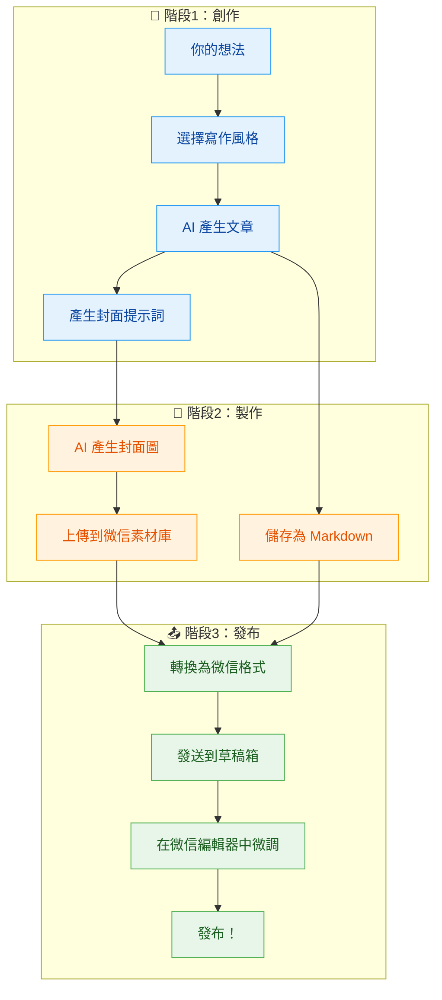

# md2wechat

<div align="center">

**用 Markdown 寫公眾號文章，像發朋友圈一樣簡單**

[](https://golang.org)
[](LICENSE)
[](https://github.com/geekjourneyx/md2wechat-skill/releases)
[](#-claude-code-整合)

---

> ### ⚠️ 重要提示：API 模式需要 md2wechat.cn API 服務
> **本工具使用 md2wechat.cn API 服務，使用 API 模式前需要先取得 API Key**
>
> - 📖 **API 文件**：https://www.md2wechat.cn/api-docs
> - 📧 **聯繫取得**：透過 [官網](https://www.md2wechat.cn/api-docs) 聯繫取得 API Key
> - 💡 **AI 模式**：不需要 API Key，直接使用 Claude 即可

---

[快速開始](#-5分鐘快速上手) • [Claude Code](#-claude-code-整合) • [功能介紹](#-核心功能) • [使用說明](#-使用方法) • [常見問題](#-常見問題)

---

## 🚀 Claude Code 使用者（推薦）

在 Claude Code 中執行以下指令即可使用：

```bash
/plugin marketplace add geekjourneyx/md2wechat-skill
/plugin install md2wechat@geekjourneyx-md2wechat-skill
```

然後直接對話：**「請用秋日暖光主題將 article.md 轉換為微信公眾號格式」**

</div>

## ✨ 這是什麼？

**md2wechat** 是一個讓你的微信公眾號寫作更有效率的神器。

> 💡 **一句話理解**：用 Markdown 寫文章 → 一鍵轉換 → 自動發到微信草稿箱

**適合誰用？**

| 你是 | 痛點 | md2wechat 幫你 |
|------|------|-----------------|
| 📝 內容創作者 | 微信編輯器太難用，排版花時間 | Markdown 寫作，自動排版 |
| 💼 產品經理 | 要發公告，但不會 HTML | 不用學程式碼，一行指令搞定 |
| 👨‍💻 程式設計師 | 習慣 Markdown，討厭微信編輯器 | 保持你的寫作習慣 |
| 🤖 AI 使用者 | 用 AI 產生內容，但要手動複製貼上 | AI 產生 → 微信草稿，無縫銜接 |

---

## 🎯 核心功能



### 三大核心功能

| 功能 | 指令 | 說明 | 適合誰 |
|------|------|------|--------|
| **Markdown 轉換** | `convert` | 將 Markdown 轉換為微信格式 HTML | 所有使用者 |
| **風格寫作** 🆕 | `write` | 用創作者風格輔助寫作，自動產生文章和封面提示詞 | 寫作新手、內容創作者 |
| **草稿推送** | `convert --draft` | 一鍵發送到微信草稿箱 | 需要頻繁發布的使用者 |

**`write` 與 `convert` 的區別：**

| 對比項 | `write` 指令 | `convert` 指令 |
|--------|--------------|----------------|
| **輸入** | 一個想法/觀點/片段 | 完整的 Markdown 檔案 |
| **輸出** | 結構化提示詞（AI 處理後產生文章） | 微信格式 HTML |
| **用途** | 從零開始創作 | 格式轉換已有內容 |
| **封面** | 自動產生封面提示詞 | 需要手動指定封面圖 |

**簡單理解：**
- `write` = 幫你寫文章（從想法到完整文章）
- `convert` = 幫你排版（從 Markdown 到微信格式）

### 兩種轉換模式

| 模式 | 適合誰 | 特點 | 樣式 |
|------|--------|------|------|
| **API 模式** | 追求穩定、快速 | 呼叫 md2wechat.cn API，秒級回應 | 簡潔專業 |
| **AI 模式** ⭐ | 追求精美排版 | Claude AI 產生，樣式更豐富 | 秋日暖光 / 春日清新 / 深海靜謐 |

### 完整工作流程



---

## 🚀 5分鐘快速上手

### 第一步：下載軟體

> 💡 **最新版本**：前往 [Releases 頁面](https://github.com/geekjourneyx/md2wechat-skill/releases) 下載

| 你的系統 | 下載連結 | 安裝位置 |
|----------|----------|----------|
| 🪟 **Windows** | [下載 .exe](https://github.com/geekjourneyx/md2wechat-skill/releases/latest/download/md2wechat-windows-amd64.exe) | 任意資料夾（或 `C:\Windows\System32\`） |
| 🍎 **Mac Intel 晶片** | [下載](https://github.com/geekjourneyx/md2wechat-skill/releases/latest/download/md2wechat-darwin-amd64) | `/usr/local/bin/` 或 `~/.local/bin/` |
| 🍎 **Mac Apple Silicon (M1/M2/M3/M4)** | [下載](https://github.com/geekjourneyx/md2wechat-skill/releases/latest/download/md2wechat-darwin-arm64) | `/usr/local/bin/` 或 `~/.local/bin/` |
| 🐧 **Linux (Intel/AMD)** | [下載](https://github.com/geekjourneyx/md2wechat-skill/releases/latest/download/md2wechat-linux-amd64) | `/usr/local/bin/` 或 `~/.local/bin/` |
| 🐧 **Linux (ARM/樹莓派)** | [下載](https://github.com/geekjourneyx/md2wechat-skill/releases/latest/download/md2wechat-linux-arm64) | `/usr/local/bin/` 或 `~/.local/bin/` |

> 🔍 **如何確認 Mac 晶片類型？**
> - 點擊螢幕左上角 **蘋果圖示** → **關於這台 Mac**
> - 查看「晶片」或「處理器」資訊：
>   - 顯示 `Apple M1/M2/M3/M4` → 下載 **Apple Silicon** 版本
>   - 顯示 `Intel` → 下載 **Intel** 版本

**安裝步驟**：

<details>
<summary><b>Windows 安裝方法</b></summary>

1. 下載 `md2wechat-windows-amd64.exe`
2. 重新命名為 `md2wechat.exe`（可選）
3. 放到任意資料夾，或複製到 `C:\Windows\System32\`（全域可用）
4. 開啟 CMD 或 PowerShell，輸入 `md2wechat --help` 測試

</details>

<details>
<summary><b>Mac 安裝方法</b></summary>

**請根據你的晶片類型選擇對應指令：**

**Apple Silicon (M1/M2/M3/M4)：**
```bash
# 下載並移動到系統目錄
curl -Lo md2wechat https://github.com/geekjourneyx/md2wechat-skill/releases/latest/download/md2wechat-darwin-arm64
chmod +x md2wechat
sudo mv md2wechat /usr/local/bin/

# 測試
md2wechat --help
```

**Intel 晶片：**
```bash
# 下載並移動到系統目錄
curl -Lo md2wechat https://github.com/geekjourneyx/md2wechat-skill/releases/latest/download/md2wechat-darwin-amd64
chmod +x md2wechat
sudo mv md2wechat /usr/local/bin/

# 測試
md2wechat --help
```

**使用者目錄安裝（無需 sudo）：**
```bash
# Apple Silicon
mkdir -p ~/.local/bin
curl -Lo ~/.local/bin/md2wechat https://github.com/geekjourneyx/md2wechat-skill/releases/latest/download/md2wechat-darwin-arm64
chmod +x ~/.local/bin/md2wechat

# Intel 晶片（將上面 URL 中的 arm64 改為 amd64）

# 加入到 PATH（如果還沒有）
echo 'export PATH="$HOME/.local/bin:$PATH"' >> ~/.zshrc
source ~/.zshrc

# 測試
md2wechat --help
```

</details>

<details>
<summary><b>Linux 安裝方法</b></summary>

**請根據你的架構選擇對應指令：**

**Intel/AMD (x86_64)：**
```bash
# 下載並移動到系統目錄
curl -Lo md2wechat https://github.com/geekjourneyx/md2wechat-skill/releases/latest/download/md2wechat-linux-amd64
chmod +x md2wechat
sudo mv md2wechat /usr/local/bin/

# 測試
md2wechat --help
```

**ARM/樹莓派 (aarch64)：**
```bash
# 下載並移動到系統目錄
curl -Lo md2wechat https://github.com/geekjourneyx/md2wechat-skill/releases/latest/download/md2wechat-linux-arm64
chmod +x md2wechat
sudo mv md2wechat /usr/local/bin/

# 測試
md2wechat --help
```

**使用者目錄安裝（無需 sudo）：**
```bash
mkdir -p ~/.local/bin
# Intel/AMD 用 amd64，ARM 用 arm64
curl -Lo ~/.local/bin/md2wechat https://github.com/geekjourneyx/md2wechat-skill/releases/latest/download/md2wechat-linux-amd64
chmod +x ~/.local/bin/md2wechat

# 加入到 PATH（如果還沒有）
echo 'export PATH="$HOME/.local/bin:$PATH"' >> ~/.bashrc  # 或 ~/.zshrc
source ~/.bashrc

# 測試
md2wechat --help
```

</details>

> ⚠️ **Mac 使用者**：下載後如果提示「無法開啟」，右鍵點擊 → 開啟 → 仍要開啟

### 第二步：設定微信（只需一次）

```bash
md2wechat config init
```

用記事本開啟產生的設定檔（會顯示路徑），填入兩個資訊：

| 設定項 | 是什麼 | 在哪取得 |
|--------|--------|----------|
| AppID | 公眾號唯一識別碼 | mp.weixin.qq.com → 設定與開發 → 基本設定 |
| Secret | API 金鑰 | 同上，需要管理員權限 |

### 第三步：開始使用

```bash
# 1. 用 Markdown 寫好文章（假設檔案叫 article.md）

# 2. 預覽效果
md2wechat convert article.md --preview

# 3. 發送到微信草稿箱
md2wechat convert article.md --draft --cover cover.jpg
```

> 💡 **小提示**：第一次使用時，指令會自動引導你完成設定。

---

## 📖 使用方法

### 基礎指令

```bash
# 預覽轉換效果（不發送）
md2wechat convert article.md --preview

# 轉換並儲存為 HTML 檔案
md2wechat convert article.md -o output.html

# 使用 AI 模式產生精美排版
md2wechat convert article.md --mode ai --theme autumn-warm --preview
```

### 風格寫作 🆕

```bash
# 查看所有可用寫作風格
md2wechat write --list

# 用 Dan Koe 風格寫文章（互動模式）
md2wechat write

# 用指定風格寫文章，從觀點產生
md2wechat write --style dan-koe

# 潤色現有文章
md2wechat write --style dan-koe --input-type fragment article.md

# 產生匹配的封面提示詞
md2wechat write --style dan-koe --cover-only

# 同時產生文章和封面
md2wechat write --style dan-koe --cover
```

**寫作風格說明：**

| 風格 | 特點 | 適合內容 |
|------|------|----------|
| **Dan Koe** | 深刻但不晦澀，犀利但不刻薄，有哲學深度但接地氣 | 個人成長、觀點文章、評論 |

**如何新增自訂風格：**

在 `writers/` 目錄下建立 YAML 檔案即可，格式參考 `writers/dan-koe.yaml`。

### 風格寫作工作原理

```
┌─────────────────────────────────────────────────────────────────────┐
│                      風格寫作 (write 指令)                            │
│                                                                       │
│  你只需要提供一個想法 → AI 自動產生符合特定創作者風格的文章            │
│                                                                       │
└─────────────────────────────────────────────────────────────────────┘
```

**核心概念：**

| 概念 | 說明 | 範例 |
|------|------|------|
| **寫作風格** | 特定創作者的寫作 DNA，包括語氣、結構、用詞習慣 | Dan Koe：深刻犀利、接地氣 |
| **輸入類型** | 你提供的內容類型 | 觀點、片段、大綱、標題 |
| **AI 模式** | 回傳結構化提示詞，由 Claude 等大型模型產生內容 | 預設模式 |
| **封面提示詞** | 根據文章內容自動產生的配圖提示 | 匹配寫作風格 |

**完整工作流程：**


**輸入類型說明：**

| 輸入類型 | 說明 | 範例 |
|----------|------|------|
| `idea` | 一個觀點或想法 | 「我覺得自律是個偽命題」 |
| `fragment` | 內容片段，需要潤色擴展 | 現有的草稿或未完成的文章 |
| `outline` | 文章大綱 | 有結構，需要填充內容 |
| `title` | 僅標題，圍繞標題寫作 | 「自律是個謊言」 |

**輸出說明：**

```bash
# AI 模式輸出（預設）
{
  "success": true,
  "mode": "ai",
  "action": "ai_write_request",
  "style": "Dan Koe",
  "prompt": "結構化的寫作提示詞..."
}

# 帶封面的輸出
{
  "success": true,
  "prompt": "文章提示詞...",
  "cover_prompt": "封面提示詞...",
  "cover_explanation": "封面設計思路..."
}
```

> 💡 **重要說明**：`write` 指令預設使用 **AI 模式**，回傳的是結構化提示詞，需要由 Claude 等 AI 大型模型處理才能產生最終文章。在 Claude Code 中使用時，這個流程是自動的。

**從想法到發布的完整流程：**



**一條指令完成全流程（在 Claude Code 中）：**

```
「用 Dan Koe 風格寫一篇關於 AI 時代程式設計師怎麼賺錢的文章，產生封面，並發送到微信草稿箱」
```

Claude 會自動：
1. 呼叫 `write` 指令產生文章和封面提示詞
2. 用 AI 產生封面圖並上傳
3. 轉換為微信格式
4. 發送到草稿箱

### 完整發布流程

```bash
# 一步到位：轉換 + 上傳圖片 + 發送草稿
md2wechat convert article.md --draft --cover cover.jpg

# 流程說明：
# 1. 將 Markdown 轉換為微信格式 HTML
# 2. 上傳封面圖片到微信素材庫
# 3. 建立草稿並推送到微信後台
```

### AI 模式主題選擇

| 主題名 | 指令 | 風格 | 適合內容 |
|--------|------|------|----------|
| 🟠 **秋日暖光** | `--theme autumn-warm` | 溫暖橙色調 | 情感故事、生活隨筆 |
| 🟢 **春日清新** | `--theme spring-fresh` | 清新綠色調 | 旅行日記、自然主題 |
| 🔵 **深海靜謐** | `--theme ocean-calm` | 專業藍色調 | 技術文章、商業分析 |

### API 模式主題選擇

| 主題名 | 指令 | 風格 | 適合內容 |
|--------|------|------|----------|
| **預設** | `--mode api` 或預設 | 簡潔專業 | 通用內容 |
| **bytedance** | `--theme bytedance` | 字節跳動風格 | 科技資訊 |
| **apple** | `--theme apple` | Apple 極簡風格 | 產品評測 |
| **sports** | `--theme sports` | 運動活力風格 | 體育內容 |
| **chinese** | `--theme chinese` | 中國傳統文化風格 | 文化文章 |
| **cyber** | `--theme cyber` | 賽博龐克風格 | 前沿科技 |

### 圖片處理

```bash
# 上傳單張圖片到微信素材庫
md2wechat upload_image photo.jpg

# 下載網路圖片並上傳
md2wechat download_and_upload https://example.com/image.jpg

# AI 產生圖片並上傳（需要設定 IMAGE_API_KEY）
md2wechat generate_image "A cute cat sitting on a windowsill"

# 產生 16:9 比例的封面圖（推薦，適配公眾號封面）
md2wechat generate_image --size 2560x1440 "prompt"
```

> 💡 **公眾號封面圖建議**：使用 16:9 橫向比例（2560x1440）作為文章封面，在微信 feed 流和文章列表中顯示效果更好。方形圖片（2048x2048）在預覽時會被裁切。

#### AI 圖片產生

在 Markdown 中使用特殊語法產生圖片：

```markdown

```

**語法格式：** ``

- 支援中文和英文提示詞
- 產生的圖片會自動上傳到微信素材庫
- 需要設定圖片產生服務（詳見 [圖片服務設定文件](docs/IMAGE_PROVISIONERS.md)）

**在 Claude Code 中使用自然語言：**
```
「幫我在文章開頭產生一張產品概念圖」
「在第三段後新增一張對比圖」
「產生一張可愛的貓」（獨立產生，不關聯文章）
```

---

## 🤖 AI 模式詳解

### 什麼是 AI 模式？

**AI 模式**使用 Claude 大型模型來產生精美的公眾號排版，而不是簡單的 API 轉換。

```
┌─────────────────────────────────────────────────────────────┐
│                     AI 模式工作流程                          │
├─────────────────────────────────────────────────────────────┤
│                                                             │
│   1. 你用 Markdown 寫文章                                    │
│              ↓                                               │
│   2. md2wechat 提取文章結構                                  │
│              ↓                                               │
│   3. 建構專業的排版提示詞 (Prompt)                           │
│              ↓                                               │
│   4. Claude AI 根據提示詞產生 HTML                          │
│              ↓                                               │
│   5. 回傳符合微信規範的 HTML                                 │
│                                                             │
└─────────────────────────────────────────────────────────────┘
```

### AI 模式的優勢

| 對比項 | API 模式 | AI 模式 |
|--------|----------|----------|
| 回應速度 | ⚡ 秒級 | 🐢 10-30秒 |
| 排版品質 | 👍 標準規範 | 🌟 精美多樣 |
| 樣式選擇 | 2-3 種 | 無限可能 |
| 成本 | 低 | 使用 Claude AI |
| 適合場景 | 日常文章 | 重要文章、品牌內容 |

### 在 Claude Code 中使用 AI 模式

如果你使用 **Claude Code**，AI 模式會自動呼叫內建的 Claude，無需額外設定：

```bash
# 在 Claude Code 中直接執行
md2wechat convert article.md --mode ai --theme autumn-warm
```

---

## ⚙️ 設定說明

### 設定檔位置

```
~/.config/md2wechat/config.yaml    # 全域設定（推薦）
```

### 設定項說明

```yaml
# 微信公眾號設定（必需）
wechat:
  appid: "你的AppID"
  secret: "你的Secret"

# API 設定
api:
  md2wechat_key: "md2wechat.cn 的 API Key"  # API 模式需要
  convert_mode: "api"                       # 預設模式：api 或 ai
  default_theme: "default"                  # 預設主題
  http_timeout: 30                          # 逾時時間（秒）

# 圖片處理設定
image:
  compress: true           # 自動壓縮大圖
  max_width: 1920         # 最大寬度
  max_size_mb: 5          # 最大檔案大小（MB）
```

---

## 📁 專案結構

```
md2wechat-skill/
├── cmd/                    # 命令列工具
│   └── md2wechat/         # 主程式
├── internal/              # 核心功能模組
│   ├── converter/        # 轉換器（API/AI）
│   ├── draft/            # 草稿服務
│   ├── image/            # 圖片處理
│   ├── wechat/           # 微信 API 封裝
│   ├── writer/           # 寫作助手 🆕
│   └── config/           # 設定管理
├── writers/              # 寫作風格設定 🆕
│   ├── dan-koe.yaml      # Dan Koe 風格
│   └── README.md         # 自訂風格指南
├── docs/                 # 詳細文件
│   ├── USAGE.md          # 使用教學
│   ├── FAQ.md            # 常見問題
│   └── TROUBLESHOOTING.md # 故障排除
├── examples/             # 範例文章
├── scripts/              # 安裝腳本
└── bin/                  # 編譯好的二進位檔案
```

---

## 🔧 進階安裝

### 方式一：Go 工具鏈

```bash
go install github.com/geekjourneyx/md2wechat-skill/cmd/md2wechat@latest
```

### 方式二：一鍵安裝腳本

**Mac/Linux：**
```bash
curl -fsSL https://raw.githubusercontent.com/geekjourneyx/md2wechat-skill/main/scripts/install.sh | bash
```

> 💡 腳本會自動偵測你的系統架構並下載對應版本

**Windows PowerShell：**
```powershell
Set-ExecutionPolicy Bypass -Scope Process -Force
iex ((New-Object System.Net.WebClient).DownloadString('https://raw.githubusercontent.com/geekjourneyx/md2wechat-skill/main/scripts/install.ps1'))
```

### 方式三：從原始碼編譯

```bash
git clone https://github.com/geekjourneyx/md2wechat-skill.git
cd md2wechat-skill
make build
```

---

## 🤖 Claude Code 整合

md2wechat 提供了 **Claude Code Skill**，讓你在 Claude Code 中直接使用自然語言轉換文章。

### 安裝方式

#### 方式一：Plugin Marketplace（推薦，最簡單）

在 Claude Code 中執行以下指令：

```bash
# 新增外掛市場
/plugin marketplace add geekjourneyx/md2wechat-skill

# 安裝外掛
/plugin install md2wechat@geekjourneyx-md2wechat-skill
```

安裝後，直接在 Claude Code 中對話即可使用：

```
請用秋日暖光主題將 article.md 轉換為微信公眾號格式
```

#### 方式二：專案內使用

克隆專案後，Skill 自動可用：

```bash
git clone https://github.com/geekjourneyx/md2wechat-skill.git
cd md2wechat-skill
# 在 Claude Code 中直接使用
```

#### 方式三：全域安裝

將 Skill 複製到全域目錄：

```bash
# 複製到全域技能目錄
cp -r skill/md2wechat ~/.claude/skills/
```

#### 方式四：建立符號連結

```bash
ln -s /path/to/md2wechat-skill/skill/md2wechat ~/.claude/skills/md2wechat
```

### 專案結構

```
md2wechat-skill/
├── .claude-plugin/        # 外掛清單
│   └── plugin.json
├── skill/                 # Claude Code Skill
│   └── md2wechat/
│       ├── SKILL.md       # 技能定義
│       ├── references/    # 參考文件
│       │   ├── themes.md      # 主題指南
│       │   ├── html-guide.md  # HTML 規範
│       │   ├── image-syntax.md # 圖片語法
│       │   └── wechat-api.md  # API 參考
│       └── scripts/       # 執行腳本
└── themes/                # AI 主題設定
    ├── autumn-warm.yaml
    ├── spring-fresh.yaml
    └── ocean-calm.yaml
```

---

## 🎓 使用範例

### 範例 1：技術部落客

```bash
# 寫好技術文章
vim my-tech-post.md

# 使用簡潔的 API 模式轉換
md2wechat convert my-tech-post.md --preview

# 滿意後發送草稿
md2wechat convert my-tech-post.md --draft --cover cover.jpg
```

### 範例 2：產品經理發公告

```bash
# AI 產生產品公告內容，然後
md2wechat convert announcement.md --mode ai --theme ocean-calm --draft --cover product-logo.png
```

### 範例 3：生活風格部落客

```bash
# 使用春日清新主題
md2wechat travel-diary.md --mode ai --theme spring-fresh --preview
```

### 範例 4：寫作新手用觀點產生文章 🆕

```bash
# 互動模式：輸入觀點，AI 產生文章
md2wechat write

# 指定風格產生
md2wechat write --style dan-koe

# 產生封面提示詞
md2wechat write --style dan-koe --cover-only
```

---

## ❓ 常見問題

<details>
<summary><b>Q: 必須要會程式設計才能用嗎？</b></summary>

**A: 不需要！** 只要會用命令列（終端機）就可以。如果是 Windows 使用者，下載 .exe 檔案後，在 CMD 或 PowerShell 中執行指令即可。
</details>

<details>
<summary><b>Q: AI 模式需要付費嗎？</b></summary>

**A:** AI 模式使用 Claude 能力：
- 如果你在 **Claude Code** 中使用，直接呼叫內建 AI
- 如果你想自己接入，需要設定 OpenAI 相容的 API
</details>

<details>
<summary><b>Q: 支援哪些 Markdown 語法？</b></summary>

**A:** 支援常用語法：
- 標題（# ## ###）
- 清單（無序、有序）
- 粗體、斜體、行內程式碼
- 程式碼區塊（帶語法高亮）
- 引用區塊
- 分隔線
- 圖片、連結
- 表格
</details>

<details>
<summary><b>Q: 產生的文章可以直接在微信編輯器中編輯嗎？</b></summary>

**A:** 可以！草稿發送後，你可以登入微信公眾平台，在草稿箱中繼續編輯。
</details>

<details>
<summary><b>Q: 如何知道應該下載哪個版本？下載錯了怎麼辦？</b></summary>

**A:**

**Mac 使用者：**
- 點擊螢幕左上角蘋果圖示 → 「關於這台 Mac」
- 看到 `Apple M1/M2/M3/M4` → 下載 **Apple Silicon (arm64)** 版本
- 看到 `Intel` → 下載 **Intel (amd64)** 版本

**Linux 使用者：**
- 執行 `uname -m` 指令
- 輸出 `x86_64` → 下載 **amd64** 版本
- 輸出 `aarch64` → 下載 **arm64** 版本

**如果下載錯了：**
- 刪除錯誤的檔案，重新下載正確版本即可
- 也可以使用一鍵安裝腳本，會自動偵測系統架構

```bash
curl -fsSL https://raw.githubusercontent.com/geekjourneyx/md2wechat-skill/main/scripts/install.sh | bash
```
</details>

<details>
<summary><b>Q: 寫作功能是什麼？怎麼用？</b></summary>

**A:** 寫作功能可以幫你用特定創作者風格產生文章：

```bash
# 查看所有可用風格
md2wechat write --list

# 互動式寫作
md2wechat write

# 指定風格寫作
md2wechat write --style dan-koe
```

只需輸入你的觀點或想法，AI 會自動產生符合該風格的文章。
</details>

<details>
<summary><b>Q: 我是寫作新手，不會寫文章能用嗎？</b></summary>

**A:** 完全可以！寫作功能專為新手設計：

1. **只需要輸入觀點**：比如「我覺得自律是個偽命題」
2. **AI 自動擴展**：會自動產生結構完整的文章
3. **多種風格可選**：內建 Dan Koe 等風格，也可以自訂

不需要你會寫作技巧，只需要有想法就行。
</details>

<details>
<summary><b>Q: 如何新增我喜歡的作家風格？</b></summary>

**A:** 在 `writers/` 目錄下建立 YAML 檔案：

```bash
# 參考內建風格
cat writers/dan-koe.yaml

# 建立自己的風格
vim writers/my-style.yaml
```

詳細格式參考 `writers/README.md`。
</details>

---

## 📚 更多文件

| 文件 | 說明 |
|------|------|
| [新手入門指南](QUICKSTART.md) | **強烈推薦！** 詳細的圖文教學 |
| [完整使用說明](docs/USAGE.md) | 所有指令和選項 |
| [寫作功能指南](writers/README.md) 🆕 | 如何使用和自訂寫作風格 |
| [寫作功能問答](docs/WRITING_FAQ.md) 🆕 | 寫作新手完整指南 |
| [常見問題](docs/FAQ.md) | 20+ 常見問題解答 |
| [故障排除](docs/TROUBLESHOOTING.md) | 遇到問題看這裡 |

---

## 🤝 貢獻

歡迎提交 Issue 和 Pull Request！

如果你有好的想法或發現了 bug，請隨時提 issue。

---

## 📄 授權條款

[MIT License](LICENSE)

---

## 💰 贊助 Buy Me A Coffee

如果這個專案幫助了您，請作者喝杯咖啡吧 ☕️

### WeChat


---

## 🧑‍💻 作者

- 作者：**geekjourneyx**
- X（Twitter）：https://x.com/seekjourney
- 公眾號：極客傑尼

關注公眾號，獲取更多 AI 程式設計、AI 工具與 AI 出海建站的實戰分享：

<p align="center">

</p>

---

<div align="center">

**讓公眾號寫作更簡單** ⭐

[主頁](https://github.com/geekjourneyx/md2wechat-skill) • [文件](docs) • [回饋](https://github.com/geekjourneyx/md2wechat-skill/issues)

Made with ❤️ by [geekjourneyx](https://geekjourney.dev)

</div>
